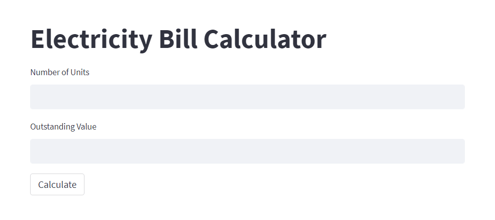
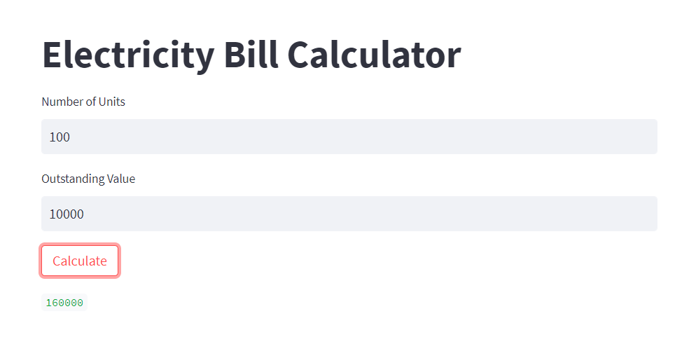

# Electricity-Bill-Calculator
This is a simple Python code to calculate electricity bill using Streamlit.

## Preview

<div align="center">

</div>
<hr>
<div align="center">

</div>

## How to use:
Clone this repository to your local machine.
Install the required dependencies:
```
pip install streamlit
```

Run the following command to start the Streamlit app:
```
streamlit run main.py
```

Enter the number of units consumed and any outstanding value.
Click the "Calculate" button.
The total bill amount will be displayed below.

**Example:**

Number of units: 100

Outstanding value: 500

Total bill amount: 1500

### Notes:

The electricity bill calculation is based on the following rates:

- 0-30 units: Rs.400 per unit
- 31-60 units: Rs.550 per unit
- 61-90 units: Rs.650 per unit
- 91-120 units:  Rs.1500 per unit
- 121-180 units:  Rs.1500 per unit
- 181+ units:  Rs.2000 per unit

  
The outstanding value is added to the total bill amount.

## Contribution:

This code is open source and contributions are welcome. Please feel free to create pull requests with any improvements or suggestions.
