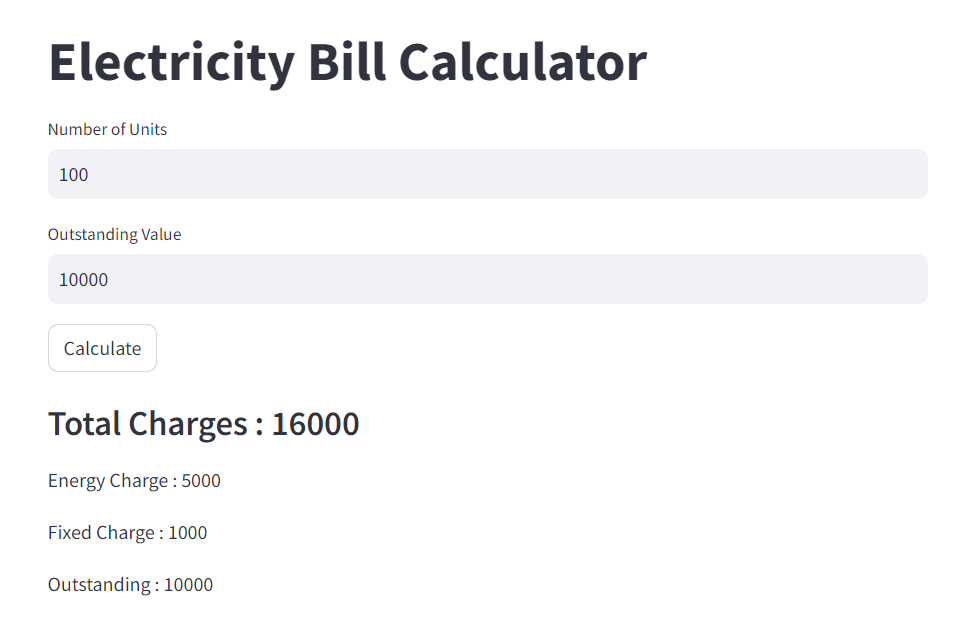

# Electricity-Bill-Calculator
This is a simple Python code to calculate electricity bill using Streamlit based on the number of units consumed..

## About
The Electricity Bill Calculator is a simple yet effective tool that allows users to estimate their electricity bills. It takes the number of units consumed and any outstanding value into account to provide a detailed breakdown of charges, including energy charges and fixed charges.

## Preview

<div align="center">

</div>
<hr>
<div align="center">

</div>

## How to use:
Clone this repository to your local machine.
Install the required dependencies:
```
pip install streamlit
```

Run the following command to start the Streamlit app:
```
streamlit run main.py
```

- Enter the number of units consumed in the text input field.
- Enter any outstanding value (if applicable).
- Click the "Calculate" button to generate the bill breakdown.
- The app will display the total charges, energy charge, fixed charge, and outstanding value.


## Contribution:

This code is open source and contributions are welcome. Please feel free to create pull requests with any improvements or suggestions.
